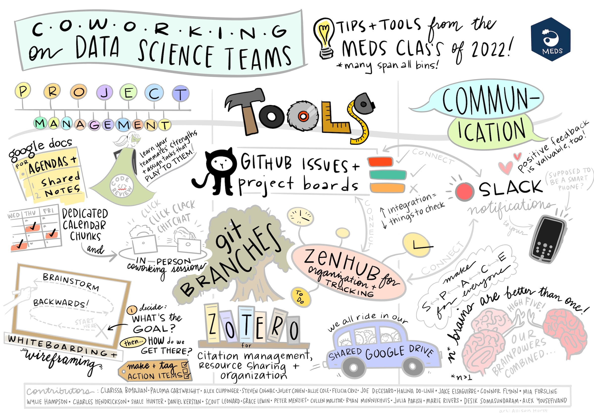

# Co-Working
Weekly co-working meetings are open to everyone who is participating in NOAA Fisheries PAM research (regardless of affiliation!). These meetings create a space for camaraderie, technical and emotional support! They can also increase productivity, foster accountability, and combat isolation (especially valuable for remote workers!).

### Co-working meetings provide a space for us to work together:

-   Need help? Join a co-working and let everyone know what you need help on. If someone can't help you right then- they may help you find the help you need!

-   Starting a project? Let others know what you are working on - they just might join you on your journey!

-   Want to share something new you learned? This is the place!

-   Want to learn a new Open Science skill? Ask!

-   Have an idea for a large collaborative project? Bring it up!

-   Want the camaraderie, but need a quiet space to work? We'll open a Quiet Room!

### What can I expect from a Co-Working meeting?

**Start:** Join the linked meeting notes and add your name to the roll call and answer the prompt. Add a comment about the type of work you want to do here (see the questions, above!)

**Announcements:** The meeting lead(s) will share any announcements, then will open up to the group to share any announcements.

**Break-out Rooms:** Lead(s) will identify break-out rooms based on comments in the roll call. This is the time to speak up if you want to get help or have a discussion in a breakout room!

**Work!** Everyone will go to their preferred break-out rooms for an hour. The lead(s) will stay in the main room (sometimes they work, sometimes it is a space for discussion).

**Check-In:** Everyone will reconvene in the main room for any followup. We highly recommend people add notes in the Co-Working Notes for their breakout rooms. What did you learn? How did it go? Anything you want to share with the group?

## Resources

[The ultimate guide to virtual co-working: Maximize productivity today](https://www.kumospace.com/blog/virtual-coworking-spaces-the-benefits-and-challenges) - Kumospace

[Organising Coworking Calls or Meetings](https://book.the-turing-way.org/collaboration/coworking/) - The Turing Way Community

[Online Co-Working Partnerships are Community of Practice in Action!](https://www.cscce.org/2020/02/04/online-co-working-partnerships-are-community-of-practice-in-action/)- Center for Scientific Collaboration and Community Engagement