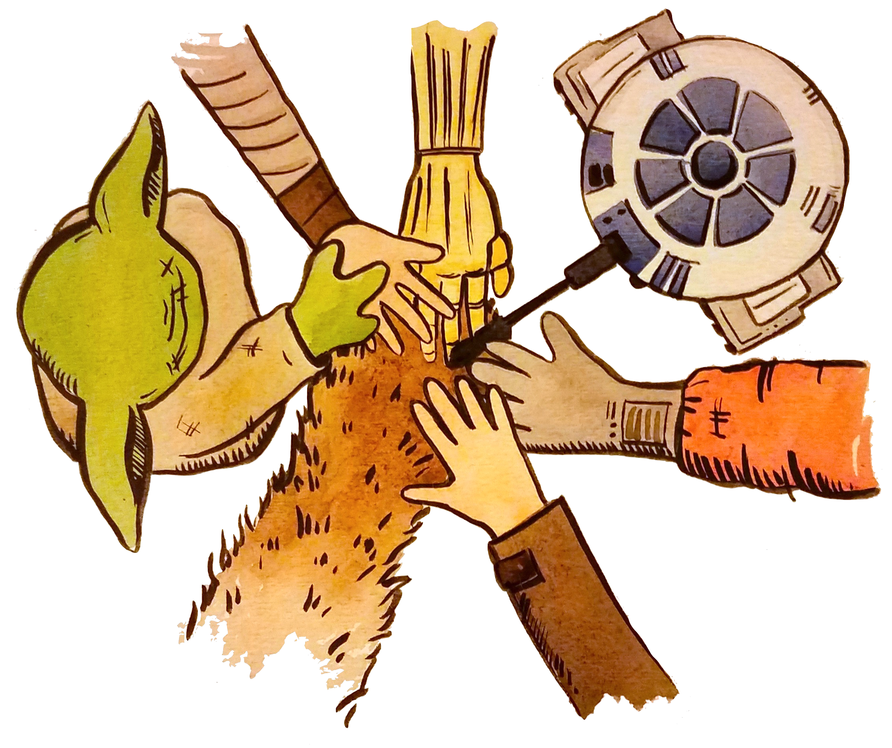

Open Science is a movement to make scientific research (including
publications, data, software) transparent and accessible so that
knowledge is shared. This repository provides resources to help NOAA
Fisheries Passive Acoustic Monitoring groups adopt an **Open Science**
approach to their research.

## NMFS PAM Open Science Committee

::::: columns
::: {.column width="50%"}
Members from each science center facilitate Co-Working meetings and
other community events:

Anne Smith (NEFSC)

Arial Brewer (NWFSC)

Jennifer McCullough (PIFSC)

Julia Zeh (NEFSC)

Kourtney Burger (SWFSC)

Lindsey Transue (AFSC)

Shannon Merkle (SEFSC)

Shannon Rankin (SWFSC)

Yvonne Barkley (PIFSC)
:::

::: {.column width="50%"}

:::
:::::

*Want to help make the magic happen? Reach out to any one of us, or ask
us at a Co-Working meeting!*

# NMFS PAM Open Science Calendar

<iframe src="https://calendar.google.com/calendar/embed?src=c_ee915939656dc82685f9d52a01c2b5cad6c8e0dec772e55272465ba18d63b9d9%40group.calendar.google.com&amp;ctz=America%2FLos_Angeles" style="border: 0" width="800" height="600" frameborder="0" scrolling="no">

</iframe>

::::: columns
::: {.column width="70%"}
### *IF YOU NEED HELP* or *IF YOU HAVE SUGGESTIONS*
:::

::: {.column width="30%"}
{width="100"}
:::
:::::

*In the spirit of collaborative open science, share any ideas or suggestions for expanding or improving this set of Open Science
materials, please follow the instructions below to submit and issue.*

Submit an Issue on THIS repository requesting help:

-   Go to <https://github.com/SAEL-SWFSC/OpenScience>

-   At top Menu Bar, click on **⊙ Issues**

-   At right, click on green NEW ISSUES button

-   Give a descriptive title, and add a description of the specific help
    you need. At the right, under Assignees, choose all three:

    -   shannonrankin

    -   Kourtney-Burger

-   One of us will help you as soon as we can!
